<p align="center">
  <a href="../../README.md"></a>
  <a href="../../README_en.md"></a>
</p>

> 操作手册 · 阶段一 · 101 · ESP32 串口与烧录 · [00 目录](00-目录.md) · [下一步](102-TB6612开环.md)

# 阶段一 · 移动机器人硬件 bring-up

| 版本 | 修订日期   | 验证环境                                      | 备注     |
|------|------------|-----------------------------------------------|----------|
| V1.0 | 2026-09-21 | Windows 10/11 + Arduino IDE 2.3.x + esp32 @ 2.0.17 | 初版 SOP |

## 1.1 ESP32 串口与烧录（Windows + Arduino IDE 2.x）

### 1.1.1 适用范围

- 开发板：CH340 USB 转串口的 **ESP32 Dev Module**（DevKit 类）
- 软件：**esp32 by Espressif Systems @ 2.0.17**（仅此 core，勿混装其他 ESP32 core）

### 1.1.2 目的

确认 **CH340、USB 数据线、驱动、Arduino IDE、烧录工具链** 均正常；**不涉及电机与驱动板**。

### 1.1.3 前提

#### 1.1.3.1 硬件

- ESP32 DevKit（板载 **CH340** USB 转串口）
- **USB 数据线**（非仅充电线）
- PC：Windows 10/11；建议 **C 盘剩余 ≥ 2～3 GB**（板包与 staging 缓存）

#### 1.1.3.2 软件

- Arduino IDE **2.3.10**（2.x 均可，记录实际版本便于复现）
- 板包：**仅**安装 `esp32 by Espressif Systems` **2.0.17**
  - **不要**再装 `Arduino ESP32 Boards by Arduino`（避免两套 core 冲突）
- 可选：安装过程中弹出 Adafruit 等非必须库/端口 → **跳过**

### 1.1.4 操作步骤

#### 1.1.4.1 安装驱动与端口

##### 1.1.4.1.1 安装驱动

1. 安装 **CH340/CH341** USB 转串口 Windows 驱动（厂商或通用 CH340 驱动包均可）。
2. **重启电脑**后再插板子。

##### 1.1.4.1.2 确认 COM 端口

1. 用 **数据线** 连接 ESP32 与电脑。
2. 打开 **设备管理器 → 端口 (COM 和 LPT)**，记下 **COMx**（例如 COM3；每台电脑/每次占用的编号可能不同）。
3. 之后在 IDE 中 **工具 → 端口** 必须选 **同一个 COMx**。

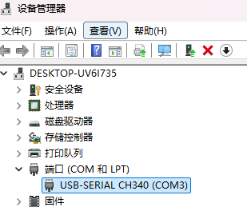

**问题分析**

| 现象 | 处理 | 原因说明 |
|------|------|----------|
| PWR 指示灯亮，但设备管理器无 COM | 更换 **USB 数据线**；换 USB 口；重新插拔；确认驱动已装且已重启 | 仅充电线无 D+/D-，无法枚举串口；若换线仍无 COM，再怀疑板载 CH340 或板子故障 |

---

#### 1.1.4.2 开发环境与烧录验证

##### 1.1.4.2.1 安装 Arduino IDE

从 Arduino 官网下载并安装 **Arduino IDE 2.x**。

##### 1.1.4.2.2 配置 Arduino IDE

1. **文件 → 首选项 → 附加开发板管理器网址**，填入：

   ```text
   https://espressif.github.io/arduino-esp32/package_esp32_index.json
   ```

2. **Show verbose output during**：
   - 日常可勾选 **compilation**
   - **上传失败**时再勾选 **upload**，便于查看 esptool/COM 详细日志  
   点击 **确定** 保存。

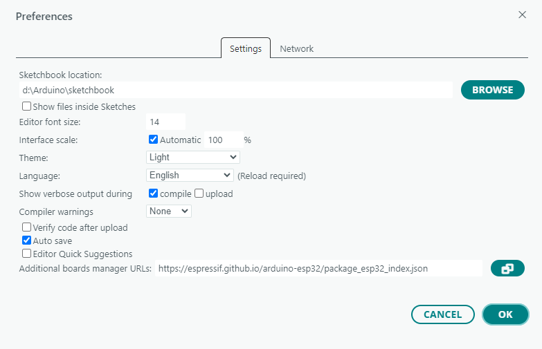

##### 1.1.4.2.3 安装 esp32 by Espressif Systems

1. **工具 → 开发板 → 开发板管理器**，搜索 `esp32`。
2. 选择 **esp32 by Espressif Systems**，版本 **2.0.17**，安装。

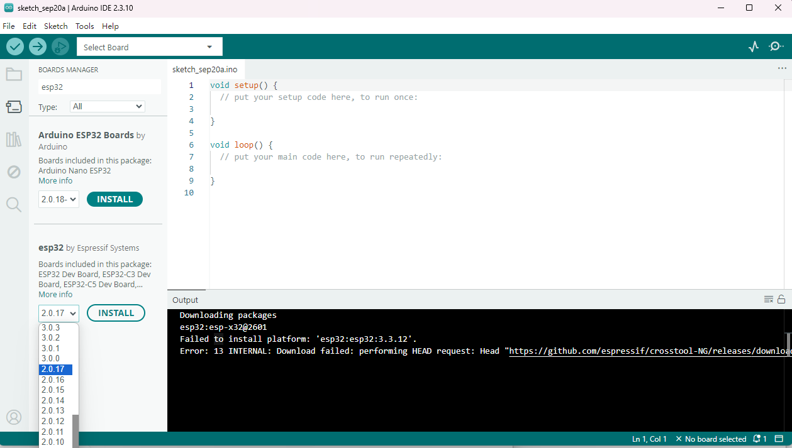  

**异常处理（在线安装失败）**

- **典型现象**：Board Manager 报 `Download failed`、GitHub 超时、`wsarecv`、长时间无进度等。
- **处理原则**：**完全退出** Arduino IDE → 手动补齐 **6 个包**（目录名必须与 Board Manager 期望一致）→ 再启动 IDE。

**6 个包清单**

| # | 类型 | 解压后相对路径（相对于对应根目录） |
|---|------|-----------------------------------|
| 1 | xtensa-esp32 gcc | `xtensa-esp32-elf-gcc\esp-2021r2-patch5-8.4.0\` |
| 2 | xtensa-esp32s2 gcc | `xtensa-esp32s2-elf-gcc\esp-2021r2-patch5-8.4.0\` |
| 3 | xtensa-esp32s3 gcc | `xtensa-esp32s3-elf-gcc\esp-2021r2-patch5-8.4.0\` |
| 4 | riscv32-esp gcc | `riscv32-esp-elf-gcc\esp-2021r2-patch5-8.4.0\` |
| 5 | esptool | `esptool_py\4.5.1\`（该层目录内应能使用 `esptool.exe`） |
| 6 | Arduino core | `esp32\2.0.17\`（内含 `boards.txt`、`platform.txt` 等） |

**根目录**

- 包 **1～5** 放在：

  ```text
  %LOCALAPPDATA%\Arduino15\packages\esp32\tools\
  ```

  示例完整路径：

  ```text
  ...\packages\esp32\tools\xtensa-esp32-elf-gcc\esp-2021r2-patch5-8.4.0\
  ...\packages\esp32\tools\esptool_py\4.5.1\
  ```

- 包 **6（core）** 放在（注意 **`hardware\esp32`** 这一层，不要只建到 `hardware`）：

  ```text
  %LOCALAPPDATA%\Arduino15\packages\esp32\hardware\esp32\2.0.17\
  ```

  解压后 **不要** 多嵌套一层 `esp32-2.0.17\esp32-2.0.17\`。

**下载链接（镜像示例 ghfast；esptool 也可用 GitHub 直链）**

```text
# 1 xtensa-esp32-elf-gcc
https://ghfast.top/https://github.com/espressif/crosstool-NG/releases/download/esp-2021r2-patch5/xtensa-esp32-elf-gcc8_4_0-esp-2021r2-patch5-win64.zip

# 2 xtensa-esp32s2-elf-gcc
https://ghfast.top/https://github.com/espressif/crosstool-NG/releases/download/esp-2021r2-patch5/xtensa-esp32s2-elf-gcc8_4_0-esp-2021r2-patch5-win64.zip

# 3 xtensa-esp32s3-elf-gcc
https://ghfast.top/https://github.com/espressif/crosstool-NG/releases/download/esp-2021r2-patch5/xtensa-esp32s3-elf-gcc8_4_0-esp-2021r2-patch5-win64.zip

# 4 riscv32-esp-elf-gcc
https://ghfast.top/https://github.com/espressif/crosstool-NG/releases/download/esp-2021r2-patch5/riscv32-esp-elf-gcc8_4_0-esp-2021r2-patch5-win64.zip

# 5 esptool（文件名带 v）
https://github.com/espressif/esptool/releases/download/v4.5.1/esptool-v4.5.1-win64.zip

# 6 esp32 core 2.0.17
https://ghfast.top/https://github.com/espressif/arduino-esp32/releases/download/2.0.17/esp32-2.0.17.zip
```

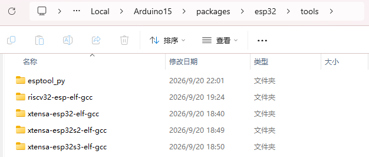
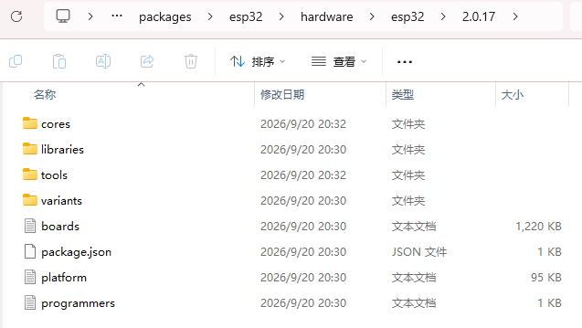

**仍失败时（可选）**

- 换 **手机热点** 后重试 Board Manager 在线安装；或  
- 在了解风险的前提下，清理 `%LOCALAPPDATA%\Arduino15\staging` 后重试在线安装（**勿误删**已解压好的 `packages\esp32\tools` 与 `hardware`）。

##### 1.1.4.2.4 连通开发板

1. **工具 → 开发板 → esp32 → ESP32 Dev Module**

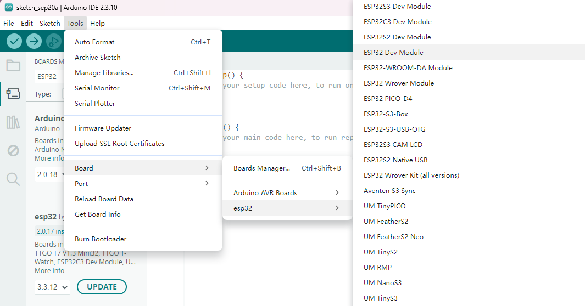

2. **工具 → 端口 → COMx**（与设备管理器一致）

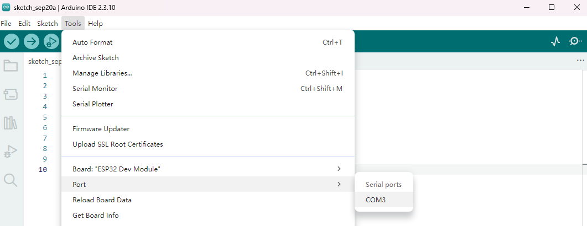

**配对成功判据**

- IDE **右下角状态栏**：`ESP32 Dev Module on COMx`
- **工具 → 端口** 中 COMx 已选中

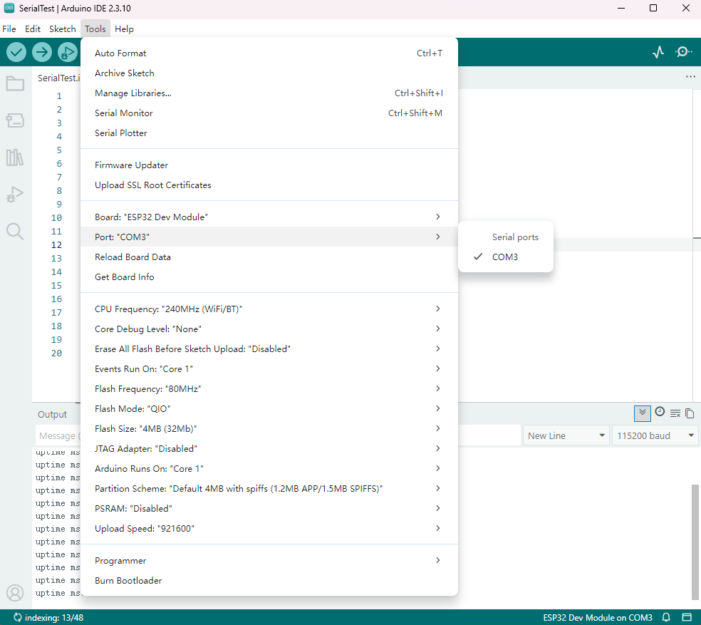

##### 1.1.4.2.5 烧录 Blink，板载 LED 闪烁

**目的**：确认编译器、esptool、USB、芯片工作正常。

**步骤**

1. **文件 → 示例 → 01.Basics → Blink**，打开示例。
2. 在 **`void setup()` 上方** 增加一行（ESP32 Dev Module 常缺此宏）：

   ```cpp
   #define LED_BUILTIN 2
   ```

   完整参考（仅多上述一行；`loop` 保持示例原样即可）：

   ```cpp
   #define LED_BUILTIN 2

   void setup() {
     pinMode(LED_BUILTIN, OUTPUT);
   }

   void loop() {
     digitalWrite(LED_BUILTIN, HIGH);
     delay(1000);
     digitalWrite(LED_BUILTIN, LOW);
     delay(1000);
   }
   ```

   > **说明**：「上传成功」**不需要**在 Blink 里写 `Serial` 或任何「关键字字符串」。  
   > **烧录是否成功**看 IDE 底部 **Output（输出）** 日志，不是改 Blink 代码。

3. 点击 **→ 上传**（可先 **✓ 验证/编译**，再上传）。
4. 若编译报错 `'LED_BUILTIN' was not declared in this scope` → 确认已添加上面 `#define` 后重新上传。

**Blink 本节通过标准（须同时满足）**

| 判据 | 说明 |
|------|------|
| Output 日志 | 出现 **`Hash of data verified`**，以及 **`Leaving... Hard resetting via RTS pin...`**（或含义相同的 Hard resetting 行） |
| 板载 LED | 约 **1 秒亮 / 1 秒灭** 循环闪烁（GPIO2 常见；若板子 LED 不在 GPIO2，以卖家资料为准，改 `#define` 引脚） |

仅 **Done compiling** 只表示编译通过；**必须以 Output 中上传完成 + 复位 + LED 行为** 为准。

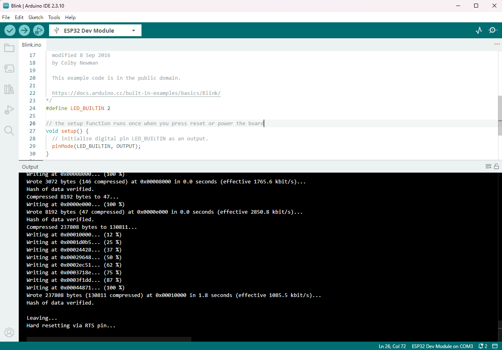  
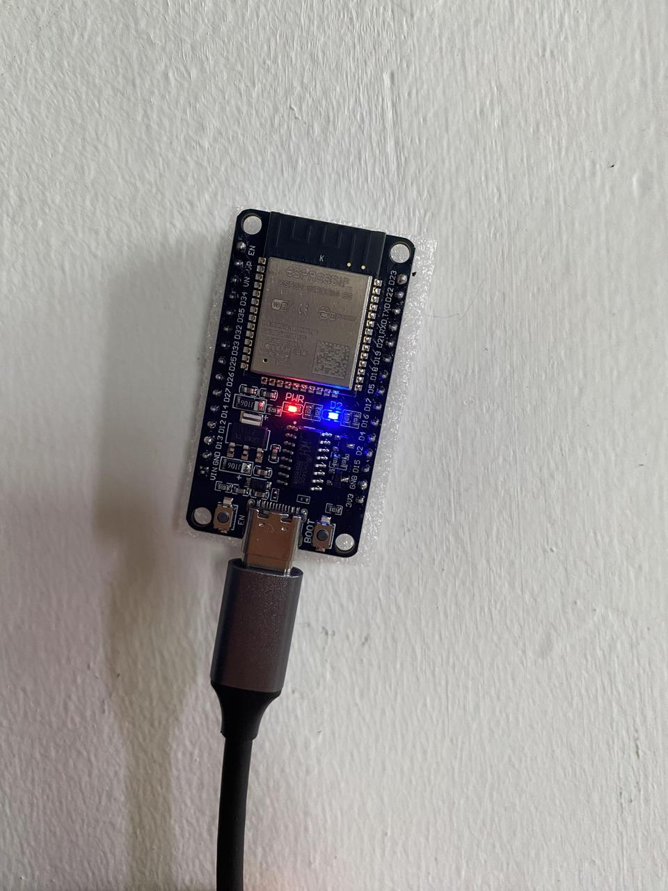

**上传失败**

| 现象 | 处理 |
|------|------|
| `Connecting....` 超时 | **工具 → Upload Speed** 改为 **115200**；按住 **BOOT**，点上传，出现 Connecting 后松开 BOOT |
| 端口被占用 | 关闭 **串口监视器**及一切占用 COMx 的软件后再上传 |

##### 1.1.4.2.6 串口监视器 115200 验证

**目的**：确认 USB 虚拟串口与 `Serial` 打印正常。

1. 新建 Sketch，命名 **SerialTest**，代码：

   ```cpp
   #define LED_BUILTIN 2

   void setup() {
     Serial.begin(115200);
     pinMode(LED_BUILTIN, OUTPUT);
     delay(1000);
     Serial.println();
     Serial.println("ESP32 Serial OK - 115200");
   }

   void loop() {
     static unsigned long last = 0;
     if (millis() - last >= 1000) {
       last = millis();
       Serial.print("uptime ms: ");
       Serial.println(millis());
     }
   }
   ```

2. 确认 **工具 → Upload Speed**（如 921600）仅影响烧录；**与下面无关**。
3. 点击 **上传**，Output 中同样应看到 **Hash verified** 与 **Hard resetting**。
4. **Ctrl+Shift+M** 打开 **串口监视器**（不是 Output 标签）；右下角波特率选 **115200**（与 `Serial.begin(115200)` 一致）。
5. 若无输出：关监视器 → 按板子 **EN/RST** → 再开监视器。

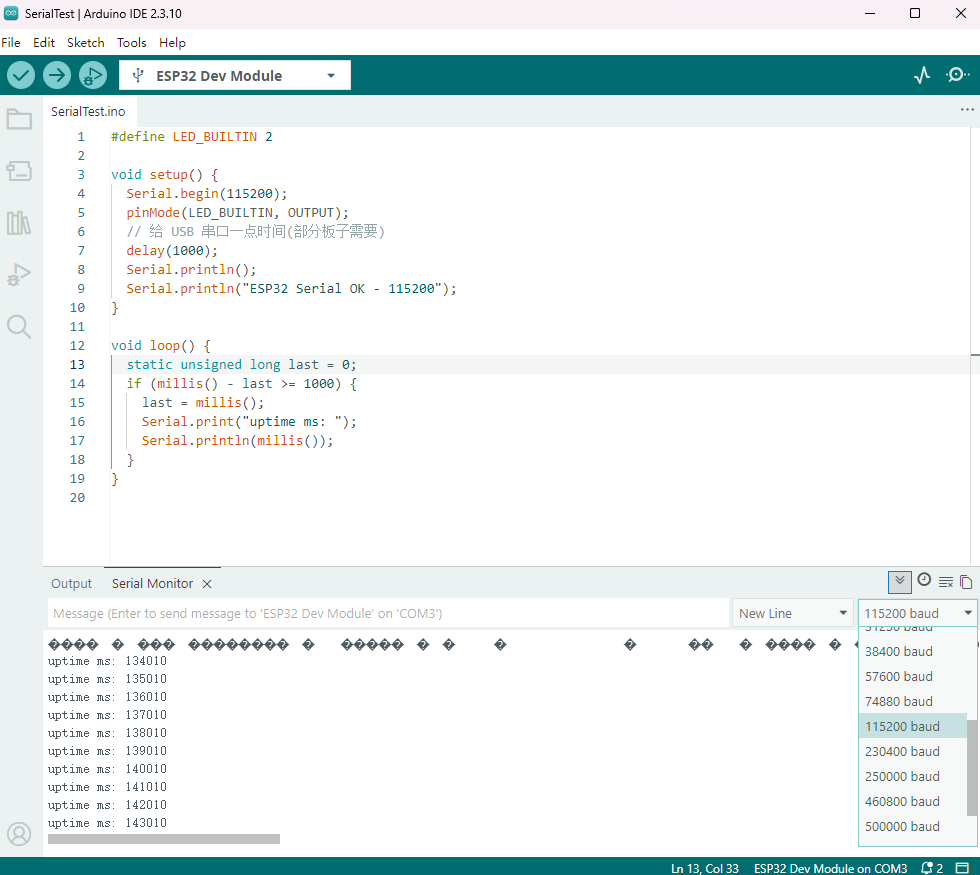

**注意事项**

- **Upload Speed ≠ 串口波特率**：前者仅烧录；后者 = `Serial.begin(n)` + 监视器右下角 **n**。
- 波特率下拉框 **只在「串口监视器」** 面板，**Output** 里没有。

**串口异常**

| 现象 | 处理 |
|------|------|
| 监视器空白 | 波特率 115200；先上传再开监视器；EN/RST 复位 |
| 仅首行乱码 | 多为复位/boot 日志；后续 `uptime ms` 正常可忽略 |
| 持续乱码 | 监视器波特率与 `Serial.begin` 不一致 |

**本节通过标准**：连续 **≥ 30 s**，约每秒一行 `uptime ms: …`，无持续乱码。

---

### 1.1.5 阶段通过标准（1.1 整节）

- [ ] 设备管理器可稳定识别 **COMx**（拔插后知道如何重新选对端口）
- [ ] **连续 2 次**上传（Blink 或 SerialTest），Output 均含 **`Hash of data verified`** 与 **`Hard resetting via RTS pin...`**
- [ ] 串口监视器 **115200** 下 SerialTest **≥ 30 s** 稳定输出
- [ ] 记录本机：**IDE 版本、core 2.0.17、板型 ESP32 Dev Module、COM 号**

---

### 下一步

**[102 TB6612 开环](102-TB6612开环.md)**

---

## 附录：Blink 与「上传关键字」对照（常见问题）

| 问题 | 答案 |
|------|------|
| Blink 里还要加什么才能算上传成功？ | **只需** `#define LED_BUILTIN 2`（LED 不在 GPIO2 时改引脚）。**不要**为「上传成功」往 Blink 里加 Serial 或打印那些英文日志字符串。 |
| 「上传关键字」在哪里看？ | Arduino IDE 底部 **Output**，上传结束后搜索 `Hash of data verified`、`Hard resetting`。 |
| LED 一直在闪算成功吗？ | 若已用 **修改后的 Blink** 上传且 Output 合格，则 **是**；若仍是旧程序/出厂 demo，需以 **本次上传的 Output** 为准。 |
| 如何让 LED 停止闪？ | 上传 **SerialTest**（默认不再闪 LED）或断电。 |