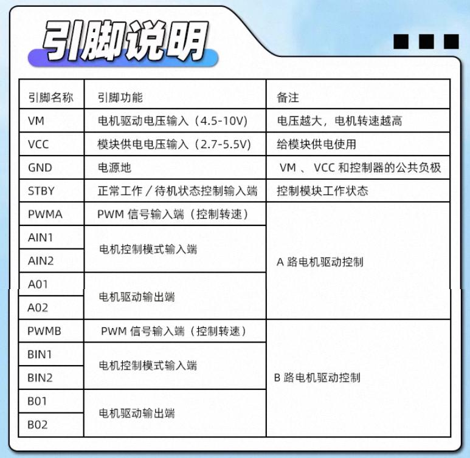
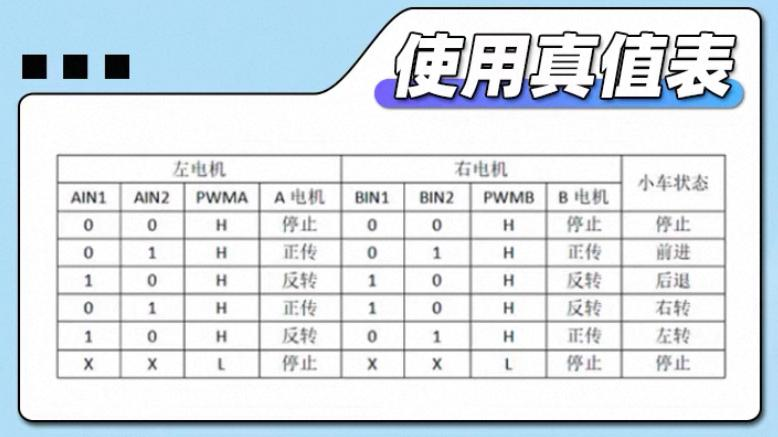
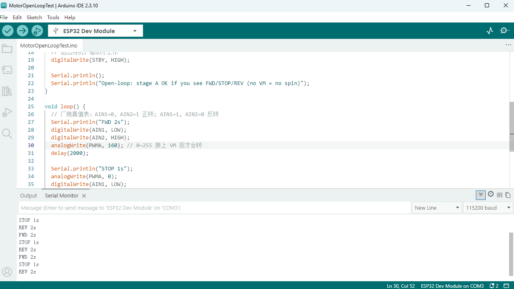
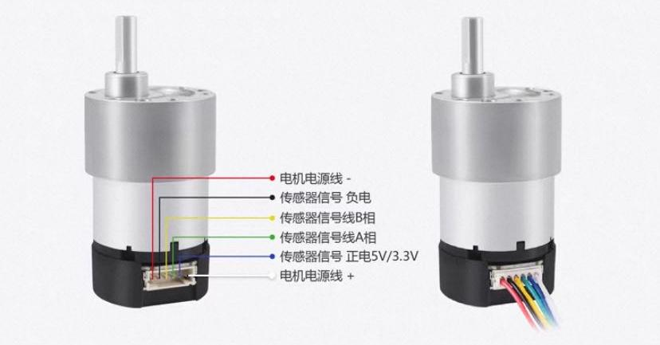

<p align="center">
  <a href="../../README.md"></a>
  <a href="../../README_en.md"></a>
</p>

> 操作手册 · 阶段一 · 102 · TB6612 开环 · [00 目录](00-目录.md) · [上一章](101-ESP32串口与烧录.md) · [下一章](103-编码器读脉冲.md)

# 102 TB6612 开环驱动

VIN 开关、四态烧录、假模块回退：[104 电源定型](104-电源定型.md)。

| 版本 | 日期 | 说明 |
|------|------|------|
| V1.0 | 2026-09-22 | TB6612双路开环驱动 |

**程序：** [MotorOpenLoopTest](../../sketchbook/MotorOpenLoopTest/MotorOpenLoopTest.ino) → [MotorOpenLoopTest_AB](../../sketchbook/MotorOpenLoopTest_AB/MotorOpenLoopTest_AB.ino)

---

## 目的与安全

- 先 **A 路** 开环（PWM + 正反转），再 **B 路 / 双路**；编码器四线绝缘不接。
- TB6612 红板 **VM = 4.5～10V**，**禁止 12V 直插 VM**、禁止 12V 接电机白/红、禁止 LM2596 OUT 接 ESP32。
- 电机离地；开关默认 OFF；改线先断电。
- 真值表正转：`AIN1=0, AIN2=1`。




102-01、102-02 截自 TB6612 模块厂商资料, 仅作引脚与真值表说明, 图片版权归原厂商

---

## 阶段A — 逻辑 + Serial(VM、电机都不接)

| TB6612 | ESP32 | 备注 |
|--------|--------|------|
| VCC | 3.3V | 勿接 5V/12V |
| GND | GND | 共地 |
| PWMA / AIN1 / AIN2 / STBY | 25 / 26 / 27 / 33 | |
| BIN1 / BIN2 | 先接 TB6612 GND | 上 B 路时必须改接 GPIO |
| VM、AO | **不接** | |

1. USB、板型 ESP32 Dev Module，打开 `MotorOpenLoopTest`（文件夹内仅一个 `.ino`）。
2. 串口 115200，应循环 `FWD 2s` / `STOP 1s` / `REV 2s`。
3. 无 VM 时电机不转是正常的。



---

## 物料(带电)

| 物料 | 用途 |
|------|------|
| 12V/5A + 开关 + 5A 保险 | 主电源，保险只串 **+** |
| 固定 5V 降压 | ESP32 VIN（可选）；**正式 VM 不用 5V** |
| LM2596 | OUT **7～8V（≤10V）→ VM** |
| 电机 ×2 | 白/红 → AO / BO |

电机六线：白/红动力；蓝绿黄黑绝缘。



102-03 截自电机/商家接线说明，仅作线色对照。

---

## 阶段 B — 适配器、保险、开关、调 VM

1. 剥线后 **万用表定极性**（约 +12V 的是 +）。5A 保险串在 12V +。自锁开关分清电源侧/负载侧。
2. 开关后 12V 并到 **5V 降压 IN** 与 **LM2596 IN**。
3. **LM2596 OUT 先不接 VM**，ON 调到 7.0～8.0V；再 OFF 接 VM。5V OUT 不要焊 VM。拧不动且 OUT≈12V → [104 坏板回退](104-电源定型.md)。
4. 开关 OFF：VM=0；ON：VM=7～8V，**绝不是 12V**。

```text
12V(+) ── 保险 ── 开关 ──┬── 5V 降压 ── ESP32 VIN（可选）
                        └── LM2596 7~8V ── TB6612 VM
12V(−) ── 共 GND　　ESP32 3.3V ── TB6612 VCC
```

烧录：主开关 OFF（VIN 未装定时先拔 USB 冲突见 104）。试转：开关 ON，ESP32 可用 USB。

电机 1 红/白 → AO1/AO2。顺序：先阶段 A Serial 正常 → 再 VM 与 AO → 架空 → 开关 ON。转向反对调 AO。烫/烟立刻 OFF。仓库 sketch 即可，勿用飞书旧「VM=5V」横幅。

---

## B 路与双路

BIN **不能再接 GND**。PWMB/BIN1/BIN2 = 32/14/12；BO1/BO2 = 电机 2 红/白。A 路线不动。上传 `MotorOpenLoopTest_AB`。PWM 160，离地。

---

## 通过标准

- [ ] 阶段 A：Serial 循环，无 VM 不转  
- [ ] VM 7～8V（或 104 回退时 ~5V），未把 12V 打进 VM  
- [ ] A 路、随后 AB：与 Serial 一致，可重复 3 轮  
- [ ] 编码器四线未接  

## 验收录像

mp4 不上 Git。YouTube / B 站链接：

- 电机 A 开环：[YouTube](https://www.youtube.com/shorts/FS3IdpszdbM) · [Bilibili](https://www.bilibili.com/video/BV1PCHp6ZEFa/)
- 电机 B 开环：[YouTube](https://www.youtube.com/shorts/xwJDwbOH4fE) · [Bilibili](https://www.bilibili.com/video/BV1skHp6bE7Z/)
- AB 双路：[YouTube](https://www.youtube.com/shorts/fDkDXerzhRc) · [Bilibili](https://www.bilibili.com/video/BV1PkHp6bE5H/)

**下一步：** [103 编码器](103-编码器读脉冲.md)
