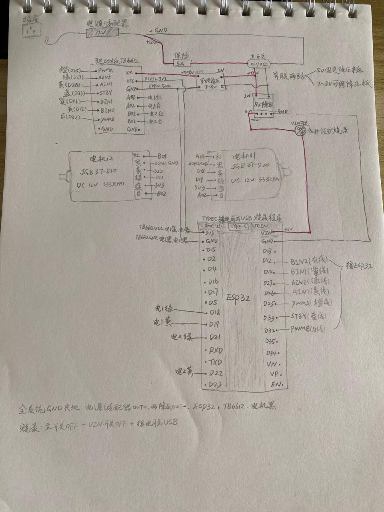

<p align="center">
  <a href="../../README.md"></a>
  <a href="../../README_en.md"></a>
</p>

> 操作手册 · 阶段一 · 104 · 电源定型 · [00 目录](00-目录.md) · [上一章](103-编码器读脉冲.md) · [下一章](105-速度PI与差速.md)

---

# 104 电源定型

**第一次开环试转**在 [102](102-TB6612开环.md)。本章一次写完 **VIN 开关、LM2596→VM、烧录四态、坏板回退**。

| 版本 | 日期 | 说明 |
|------|------|------|
| V1.0 | 2026-09-25 | 附: 手绘接线示意图-20260925 |

---

## 电源树

- **保险：** 12V **+** 侧串 **5A**。
- **禁止：** 12V 直插 VM / VIN / 3.3V；**LM2596 OUT 不得接 ESP32**。
- **烧录：** 主开关 OFF + VIN 开关 OFF + 电脑 USB。
- **主开关后 12V 并联：** 固定 5V 降压 IN、LM2596 IN。  
  - 5V OUT **只经 VIN 开关 → ESP32 VIN**  
  - LM2596 OUT **只到 TB6612 VM**
- **共地：** 适配器 −、两降压 IN−/OUT−、ESP32 GND、TB6612 GND、编码器黑线并入 ESP32 GND。

```text
12V(+) ── 5A保险 ── 主开关 ──┬── 5V 降压 IN    OUT+ ── VIN开关 ── ESP32 VIN
                            │                 OUT− ── ESP32 GND
                            └── LM2596 IN     OUT+ ── TB6612 VM
                                              OUT− ── 共 GND
12V(−) ── 全系统 GND
ESP32 3.3V ── TB6612 VCC + 编码器蓝
```



---

## 操作步骤

原则：**LM2596 OUT+ 不接 VM 时调 W103**；电压 **>10V** 立刻主开关 OFF。

1. 断电，主开关 OFF。
2. **5V 板：** 拔掉接到 TB6612 **VM/GND** 的输出（若还在）。OUT+ 串 **VIN 开关** 再接到 ESP32 **VIN**；OUT− 接 ESP32 GND。
3. 主开关负载侧再并一路到 **LM2596 IN**（红 +、黑 −）。**OUT 先空载。**
4. 主开关 ON，表笔测 LM2596 输出，调到 **7～8V**：偏高则 OFF，拧 W103（常见顺时针升压，**以表为准**），每次约 1/4 圈再测。OUT 仍 ≈IN（如 ~11.6V）且旋钮无效 → **停**，按下节坏板回退。
5. 主开关 OFF，OUT+ → **VM**，OUT− → TB6612 GND。再 ON，复测 VM。
6. 杜邦、AO/BO、编码器 **不用因本章改**。上传 `MotorOpenLoopTest_AB`，主开关 ON、VIN ON、**无 USB**，确认双机比 5V VM 更有劲。

---

## LM2596 坏板回退

空载、输入 ~12V，W103 怎么拧 OUT 都约 **11.6V** → 模块坏。拆掉 LM2596，并出来的线绝缘悬空，等换板再从本节步骤 3 做。

**LM2596 未通过前：** VM 接 5V 降压 OUT+（与 103/104 早期相同）；**不要同时接** LM2596 OUT。此时 5V OUT+ 分两路，VIN 开关那路不动：

```text
OUT+ ─┬─ [VIN 开关] → ESP32 VIN
      └─ TB6612 VM
OUT− ── 共 GND
```

---

## 通过标准

### 场景（主开关 / VIN / USB）

| 场景 | 主开关 | VIN | USB | 期望 |
|------|--------|-----|-----|------|
| 烧录 | OFF | OFF | ON | 电机不转，能上传 |
| 脱线跑 | ON | ON | OFF | 按程序转 |
| 边 Serial 边跑 | ON | OFF | ON | 能看日志，电机可能转；**禁止在此 Upload** |
| 避免 | ON | ON | ON | 双 5V，别用来烧录 |

### 电压

| 状态 | VM | VCC | VIN（VIN 开） |
|------|-----|-----|----------------|
| LM2596 已通过 | 7～8V | ~3.3V | ~5V |
| 回退 5V VM | ~5V | ~3.3V | ~5V |
| 主开关 OFF、未插 USB | 0V | 0（板没电） | 0V |
| 烧录：主 OFF + VIN OFF + USB | 0V | ~3.3V | 0（VIN 断开） |

- `MotorOpenLoopTest_AB` 运转正常。  
- 烧录前 `setup()` 先 STBY=LOW / 停电机，减少复位抖转。

完成后进入 [105 PID / 差速](105-速度PI与差速.md)。样车验证 [106](106-样车验证.md)。
