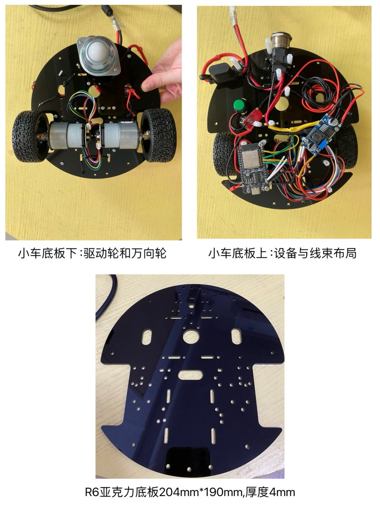
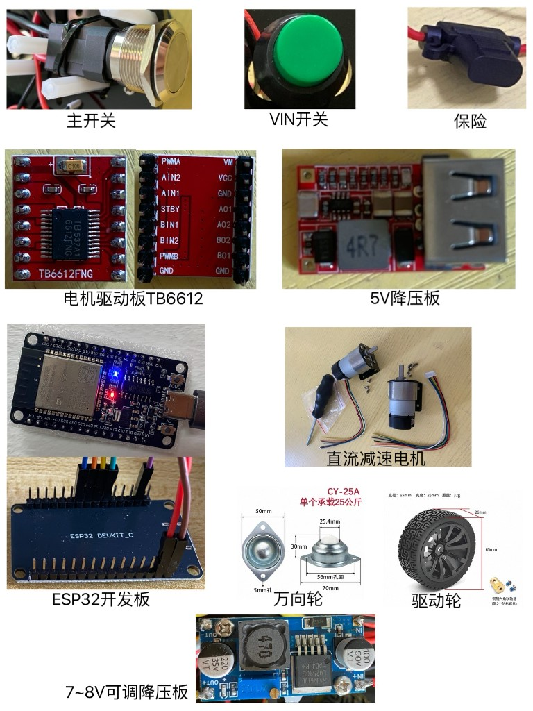

  
  

> 操作手册 · 阶段一 · **样车验证** · 106 · [00 目录](00-目录.md) · [上一章](105-速度PI与差速.md) · [阶段二 200](200-ROS接入.md)

# 样车验证

**程序：** [DiffDrive.ino](../../sketchbook/DiffDrive/DiffDrive.ino)

烧录：主开关 OFF、VIN OFF、USB。地面发 `d` / `r`：主开关 ON、VIN OFF、USB（[104](104-电源定型.md) 边 Serial 边跑）。转角用 **`r`**（原稿写成 `d 90` 是笔误，`d` 只表示米）。

---

## 1.6.1 装车

- **R6 亚克力底板：** 厚 4 mm，长 204 mm × 宽 190 mm。
- 轮子与电机用 **6 mm 联轴器**，再经电机支架装到驱动轮位。轮直径 **65 mm**，底板水平时离地约 **70 mm**。两差速轮 **外边距 18.5 cm**，轮宽约 **25 mm**（官方 **26 mm**）。轨距 **L = 外边距 − 单轮宽 = 185 − 26 = 159 mm**（`WHEELBASE = 0.159`）。内边距不要当 L。
- **万向轮 CY-25A2** 高 30 mm，加 **40 mm 尼龙柱**，与两驱动轮同高，保证底盘水平。
- ESP32、可调降压、开关、TB6612、5V 降压：无螺丝孔的找空位摆放，**引脚绝缘**，勿碰其它金属；线束轧带捆好。
- 上电前再量一遍 **VM / VCC / GND**。固件：`SIGN_A = 1`，`SIGN_B = -1`（`v 0.08` 向前）。

---

## 1.6.2 硬件清单与样车

样车（底板下驱动轮+万向轮、底板上线束、空板尺寸）：

硬件清单（主开关、VIN 开关、保险、TB6612、5V 板、电机、ESP32、万向轮、驱动轮、LM2596）：

样车视频暂无单独成片，以本节照片为准。

---

## 1.6.3 直行 1 米

- 地面标 **起点、0.5 m、1.0 m**。
- 车头万向轮放在 **0 m**，车身摆正。
- 串口发 **`d 1.00`**。摆正后几乎无横偏；路程约 **1.04 m**。
- 再发 **`d 0.96`**：实走约 **1.0 m**，横向仍可能有约 **4 cm**。

- 直行约 1 m：[YouTube](https://youtu.be/OrOgSyiR2sc) · [Bilibili](https://www.bilibili.com/video/BV1LJHp65Eb5/)

---

## 1.6.4 旋转 90° / 180°

- 地面标 **0°** 与 **90°**（十字），车头朝 0°、车身摆正。
- **`r 90`（右转 90°）**，停时应对准 90°；多次肉眼几乎无误差。
- 再测 **`r -90`（左转回初始）**、**`r 180`（右转 180°）**、**`r -180`（左转 180° 回初始）**。
- 不要用单次 `w 0.8` 当 90°（约 2 s 超时会提前停）。若 `r 90` 实际在左转，四条符号整体取反。

- 原地 90° / 180°：[YouTube](https://youtu.be/yye5On57KsE) · [Bilibili](https://www.bilibili.com/video/BV1o7Hp61EPy/)

阶段一到此。ROS：[200](200-ROS接入.md)。